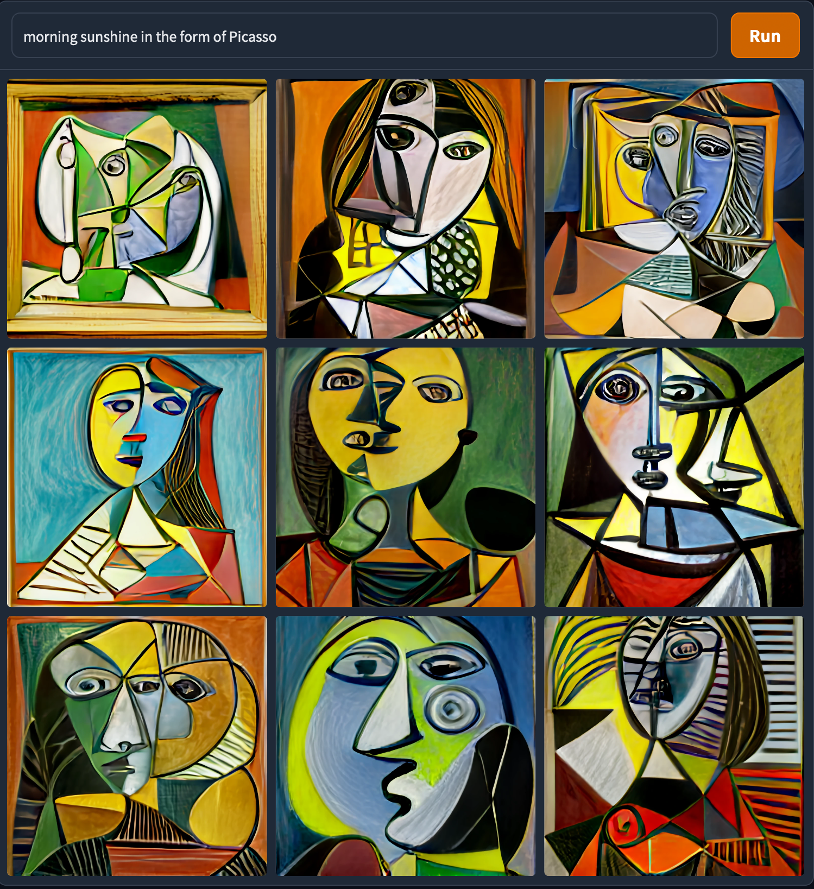

# DALL-E Mini Image Generation

This project uses the [DALL-E mini](https://github.com/borisdayma/dalle-mini) model to generate a new image based on a given prompt. The code is written in Python and uses the dalle-mini library.





## Dependencies

To run this project, you need to have Python 3.6 or later installed. Additionally, you need to install the following library:

- dalle-mini

You will need a GPU (CUDA) support as well.

You can install it using the following command:

```
pip install -r requirements.txt
```

## Usage

To just run as is:

```bash
python main.py
```


To use the `generate_image_dalle` function, you need to provide a prompt as input:

```python
from main import generate_image_dalle

prompt = "sunset with mountains in the background"
generated_image = generate_image_dalle(prompt)
generated_image.save("generated_image.jpg")
```

The `generate_image_dalle` function returns the generated image as a Python Imaging Library (PIL) Image object. You can save the generated image to a file using the `save()` method, as shown in the example.

## Code Explanation

The `generate_image_dalle` function does the following:

1. Loads the DALL-E mini model using the `CustomDALLE` class.
2. Generates images using the DALL-E mini model by passing the prompt to the `generate_images` function.
3. Chooses the first image from the generated images.

The function returns the generated image as a PIL Image object.
